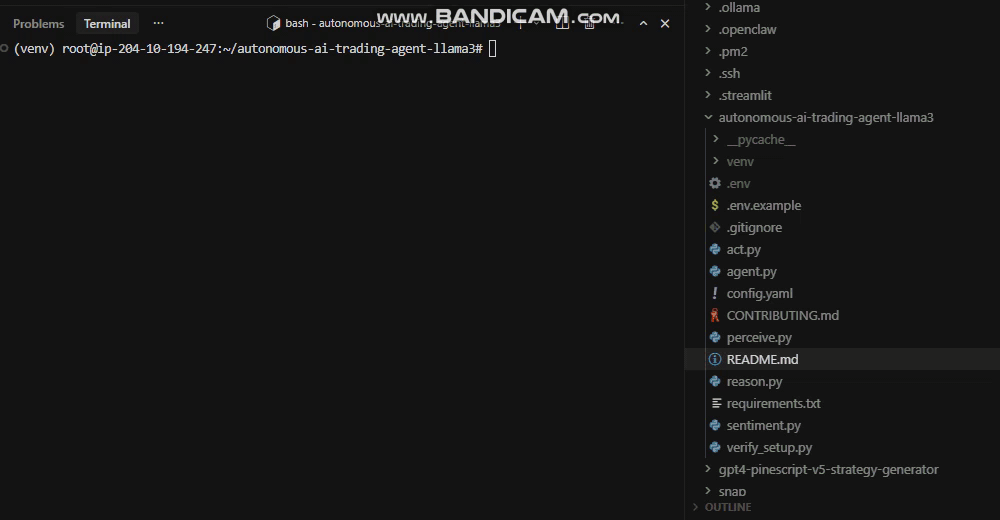

<div align="center">

# Autonomous AI Trading Agent for Crypto and Stocks

### Agentic trading system built with Python, Llama 3, CCXT, and Ollama



</div>

## What This Project Does

This repository is an autonomous AI trading agent built in Python for crypto and stock market workflows. It uses an agentic **Perceive → Reason → Act** loop to analyze technical indicators, news sentiment, and market context before generating a trading decision.

The system connects to exchanges through **CCXT**, supports **paper trading** and **live trading**, and logs each decision for review. It is designed for traders and developers who want a transparent trading bot with LLM-based reasoning instead of a simple rule-only strategy.

The current public version includes:
- Llama 3 trading reasoning
- technical indicator analysis
- news sentiment injection
- multi-exchange trading through CCXT
- paper mode for safe testing
- local Ollama fallback support

This project is useful for traders building AI-assisted execution systems, researchers testing agentic trading workflows, and developers exploring local LLM trading infrastructure.

> Public beta is available in this repository. A larger private build is under active development.

**🟢 Public Beta (this repo)** — Core agent logic, open-source, free forever.
**🔒 Private Build (invite only)** — The full system: multi-timeframe reasoning, portfolio management, backtesting, custom fine-tuned LLM, and a proprietary strategy layer built hand-in-hand with active traders.

The gap between the two tracks is exactly what serious traders reach out about.

**The mission:** Give independent traders access to institutional-grade AI reasoning — local, private, and without paying for cloud APIs.

---

## 📊 Current Beta Status

| Module | Status | Version |
|---|---|---|
| Core Agentic Loop (Perceive → Reason → Act) | ✅ Live | v0.3.1 |
| Llama 3 CoT Reasoning Engine | ✅ Live | v0.3.1 |
| CCXT Multi-Exchange Connector | ✅ Live | v0.3.1 |
| News Sentiment Injection | ✅ Live | v0.2.8 |
| Paper Trading Mode | ✅ Live | v0.3.0 |
| Live Trading Mode | ✅ Live | v0.3.1 |
| Web Dashboard (FastAPI + React) | 🔨 In Progress | v0.4.0 |
| Backtesting Engine | 🔨 In Progress | v0.4.0 |
| Multi-Asset Portfolio Management | 🔜 Planned | v0.5.0 |
| Custom Fine-Tuned Trading LLM | 🔜 Planned | v0.6.0 |

> 📅 **Last commit:** Active daily · **Next release:** v0.4.0 targeting Web Dashboard + Backtesting

---

## 🔓 Public Beta vs 🔒 Full Private Build

| Feature | 🔓 Public Beta (this repo) | 🔒 Full Version (private) |
|---|---|---|
| Core Agentic Loop | ✅ Included | ✅ Included + optimized |
| Llama 3 CoT Reasoning | ✅ Included | ✅ Included + enhanced prompts |
| CCXT Exchange Support | ✅ 100+ exchanges | ✅ 100+ exchanges |
| News Sentiment | ✅ Basic | ✅ Advanced multi-source scoring |
| Backtesting Engine | ❌ Not yet | ✅ Full historical replay |
| Web Dashboard | ❌ Not yet | ✅ Live monitoring UI |
| Multi-Asset Portfolio | ❌ Not yet | ✅ Multi-pair simultaneous reasoning |
| Custom Fine-Tuned LLM | ❌ Not yet | ✅ LoRA-trained on financial data |
| Proprietary Strategy Layer | ❌ Not included | ✅ Built with real trader input |
| Support | Community | Direct access to the dev team |

> **Want the full version?** → [See how to get access below ↓](#-want-the-full-version)

---

## 🧠 How the Agent Reasons

Standard bots follow rules. This agent **thinks.**

Every trade cycle runs a full **Perceive → Reason → Act** loop powered by a locally running Llama 3 model:

```
╔══════════════════════════════════════════════════════════════╗
║              AGENTIC TRADING LOOP — FULL CYCLE               ║
╠══════════════╦══════════════════════╦════════════════════════╣
║  1. PERCEIVE ║    2. REASON         ║  3. ACT                ║
║  ──────────  ║    ──────────────    ║  ──────────────────    ║
║  • EMA 9/21  ║    • Llama 3 CoT     ║  • MARKET BUY order   ║
║  • RSI 14    ║    • Trade Thesis    ║  • LIMIT SELL order   ║
║  • MACD      ║    • Risk Score      ║  • HOLD (skip cycle)  ║
║  • BB Bands  ║    • Confidence %    ║  • Alert + log        ║
║  • News Feed ║    • Written logic   ║                        ║
║  • Sentiment ║                      ║                        ║
╚══════════════╩══════════════════════╩════════════════════════╝
```

### Live Chain-of-Thought Output Sample

```
═══════════════════════════════════════════════════════════════
 AGENT REASONING LOG — BTC/USDT — 2026-03-12 09:14:22 UTC
═══════════════════════════════════════════════════════════════
 TECHNICAL SIGNALS:
   RSI(14)           = 28.4  → OVERSOLD threshold crossed
   EMA(9) vs EMA(21) = CROSS → Short-term bearish crossover
   MACD Histogram    = -142  → Bearish momentum confirmed
   Bollinger Band    = LOWER → Price touching lower band

 NEWS SENTIMENT:
   Headlines scanned : 6 (last 2 hours)
   Sentiment score   : -0.62 (Bearish)
   Top signal: "Fed signals further rate hikes — risk-off mood"

 LLM REASONING:
   "RSI is deeply oversold at 28.4, signaling a potential
   bounce. However, EMA crossover and MACD confirm bearish
   momentum. News sentiment adds macro headwind. Conflicting
   signals — oversold technicals vs. bearish macro context —
   suggest waiting for confirmation before entering long."

 DECISION:   ⏸  HOLD
 CONFIDENCE: 71%
 NEXT CHECK: 15 minutes
═══════════════════════════════════════════════════════════════
```

---

## 🚀 Key Features

- 🧠 **Local LLM Reasoning** — Llama 3 (8B or 70B) runs fully offline via `Ollama`. Zero API costs, zero data exposure.
- 🔗 **Chain-of-Thought Transparency** — Every decision comes with a written reasoning trace. No black boxes.
- 📡 **100+ Exchange Support** — Binance, Bybit, OKX, Kraken, KuCoin, Coinbase via [CCXT](https://github.com/ccxt/ccxt).
- 📰 **Real-Time News Injection** — Live headlines from Finnhub / CryptoPanic scored and fed directly into the LLM prompt.
- 📊 **Multi-Signal Analysis** — EMA, RSI, MACD, Bollinger Bands processed simultaneously.
- 🔒 **Zero-Knowledge Execution** — Your keys, strategies, and positions never leave your machine.
- 🪶 **Consumer Hardware Ready** — 8GB VRAM minimum (Llama 3 8B). Tested on RTX 3080, RTX 4090, Apple M2/M3.

---

## ⚡ Want the Full Version?

> **The public beta shows you what the agent can do. The full build shows you what it can really do.**

If you are a serious trader — actively trading crypto or stocks, looking for a system that goes far beyond indicator bots — we want to talk.

The full private build includes everything in the roadmap **already completed and running**, plus a strategy layer we don't publish publicly.

### Who This Is For

| You are... | You get... |
|---|---|
| 🧑‍💼 **An active crypto / stock trader** | Full agent access + onboarding support |
| 📈 **A quant or systematic trader** | Access to backtesting engine + strategy layer |
| 🏢 **A fund or prop desk** | Private deployment + direct collaboration |
| 👥 **A trading community leader** | Partnership discussion + community build |

### How to Reach Us

We keep this simple. No forms. No waitlists. Direct contact only.

**→ Visit our GitHub profile and use the contact / social links listed there.**

We respond to serious traders. Tell us:
- What markets you trade and your current setup
- What's missing from your current tools
- What you want this agent to do for you

> 💬 *The traders who reach out directly get priority access. The ones who wait, wait.*

---

## 🤝 Open-Source Contributions

If you want to contribute to the public beta directly — new exchange connectors, indicator modules, prompt improvements — PRs are welcome.

1. Fork the repo
2. Create your branch: `git checkout -b feature/your-feature`
3. Commit and push
4. Open a Pull Request

See [CONTRIBUTING.md](CONTRIBUTING.md) for guidelines.

---

## 🛠️ Installation

### Prerequisites
- **Python 3.10+** (Ubuntu: `sudo apt install python3 python3-venv python3-pip`)
- [Chutes AI](https://chutes.ai) API key — for LLM reasoning
- Exchange API keys (read + spot trade) — *optional for paper mode*

### 1. Clone
```bash
git clone https://github.com/Rezzecup/autonomous-ai-trading-agent-llama3.git
cd autonomous-ai-trading-agent-llama3
```

### 2. Install Dependencies (recommended: use a virtual environment)
```bash
python3 -m venv venv
source venv/bin/activate   # On Windows: venv\Scripts\activate
pip install -r requirements.txt
```
> **Important:** You must run `source venv/bin/activate` before running the agent. Your prompt will show `(venv)` when active.

> **Alternative (system install):** `pip3 install -r requirements.txt` or `python3 -m pip install -r requirements.txt`

### 3. Configure
```bash
cp .env.example .env
# Add your Chutes AI API key (required for LLM reasoning)
# Optional: exchange API keys for live trading; CRYPTOPANIC_API_KEY for news sentiment
```
Edit `.env` and set:
```
CHUTES_API_KEY=your_chutes_api_key_here
```

### 4. Verify Setup (optional)
```bash
python verify_setup.py   # or python3 verify_setup.py
```

### 5. Run in Paper Mode First
```bash
python agent.py --symbol BTC/USDT --exchange binance --mode paper
```
> On Ubuntu/Linux, use `python3` if `python` is not available: `python3 agent.py --symbol BTC/USDT --exchange binance --mode paper`
>
> **Note:** `CHUTES_API_KEY` is required. When Chutes returns 429 (rate limit), the agent automatically falls back to **local Ollama**. Install [Ollama](https://ollama.ai) and run `ollama pull llama3` or `ollama pull llama3.2` for fallback support.

---

## ⚙️ Configuration

```yaml
# config.yaml

trading:
  symbol: "BTC/USDT"
  exchange: "binance"        # binance | bybit | okx | kraken | kucoin
  timeframe: "15m"
  mode: "paper"              # paper | live
  position_size_pct: 5

llm:
  model: "meta-llama/Llama-3.1-8B-Instruct"   # Chutes AI model
  temperature: 0.2
  max_tokens: 512

indicators:
  rsi_period: 14
  ema_fast: 9
  ema_slow: 21
  macd_fast: 12
  macd_slow: 26
  macd_signal: 9

news:
  provider: "cryptopanic"
  lookback_hours: 2
  max_headlines: 5
```

---

## 📁 Project Structure

```
autonomous-ai-trading-agent-llama3/
│
├── agent.py              ← Main agentic loop
├── perceive.py           ← Indicators + news fetcher
├── reason.py             ← Llama 3 CoT prompt engine
├── act.py                ← CCXT order execution
├── sentiment.py          ← News scoring module
├── config.yaml           ← Strategy configuration
├── verify_setup.py       ← Setup verification script
├── requirements.txt
├── .env.example
└── README.md
```

---

## 🗺️ Roadmap

### ✅ Shipped (Public Beta)
- [x] Core Perceive → Reason → Act loop
- [x] Llama 3 Chain-of-Thought reasoning engine
- [x] CCXT multi-exchange integration (100+ exchanges)
- [x] Real-time news sentiment injection
- [x] Paper + Live trading modes

### 🔨 In Active Development
- [ ] **Web Dashboard** — FastAPI + React real-time monitoring UI *(v0.4.0)*
- [ ] **Backtesting Engine** — Replay historical data through the LLM reasoning loop *(v0.4.0)*

### 🔜 Coming Next
- [ ] **Multi-Asset Portfolio Manager** — Simultaneous multi-pair reasoning *(v0.5.0)*
- [ ] **Telegram + Discord Alerts** — Real-time trade notifications *(v0.5.0)*
- [ ] **Custom Fine-Tuned Trading LLM** — LoRA-trained on financial reasoning data *(v0.6.0)*
- [ ] **Stock Market Support** — Alpaca / Interactive Brokers integration *(v0.6.0)*

---

## 📬 Contact & Access

The fastest way to get access to the full build is direct contact via our GitHub profile.

**→ [Visit our GitHub Profile](https://github.com/Rezzecup)** — all social and contact links are listed there.

We are available on the platforms listed in our profile. Reach out, introduce yourself as a trader, and let's talk.

---
